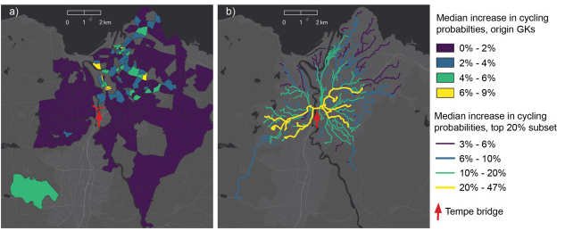
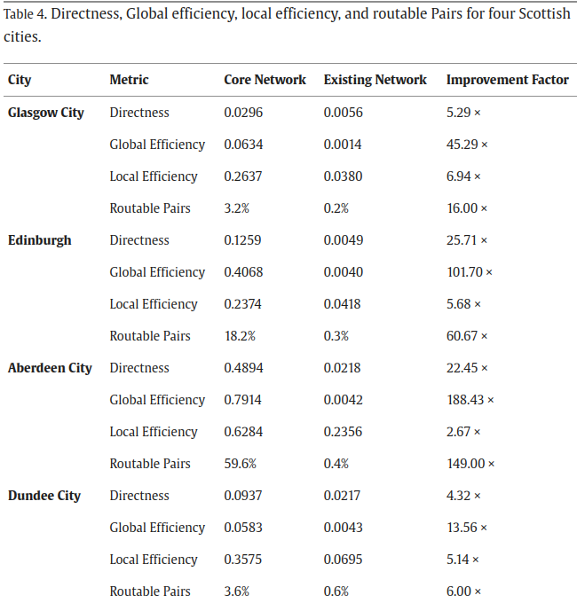
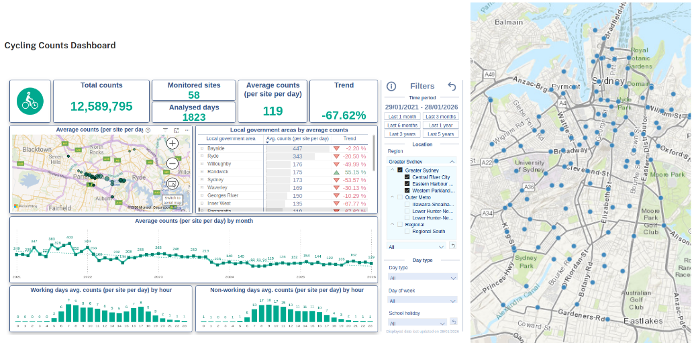

```{r setup, include=FALSE}
knitr::opts_chunk$set(eval = FALSE,
                      message = FALSE, 
                      warning = FALSE, 
                      out.width = "100%",
                      fig.align = "center",
                      dpi = 300)
```

# Background

Sustainable and low-carbon cities are key for addressing climate change, air pollution, and urban congestion. 

Previous research found safe, high-quality and efficient cycling networks play a crucial role in uptake cycling levels [@cambra2019; @christ2023; @félix2020; @félix2022; @félix2019; @schoner2014].
In recent decades, several urban centers invested in cycling infrastructure [@félix2020].
During COVID-19, cities introduced pop-up bike lanes, but their planning was often not evidence-based.
Consequently, the outcome is a highly fragmented cycling network due to a lack of cohesive strategies or ad-hoc, stretch-specific planning approaches [@moura2017], lacking efficiency.

These approaches often overlook the broader network, resulting in missing links that hinder seamless and safe cycling connectivity.
**These missing links act as huge barriers for potential cyclists** [@félix2019], while minor infrastructure additions, when solved, could significantly strengthen networks [@fernandes2020], providing great potential for cycling leverage [@félix2025], and allowing cyclists to safely bicycle between more origins and destinations.
Many authorities lack experience in cycling network planning [@lovelace2017], reinforcing the need for decision-making support tools regarding investments in cycling infrastructure, that account for practical implementation barriers such as urban planning constraints and funding limitations.

European cities are committed to meeting sustainable transport targets, and increasing active travel.
The Portuguese National Cycling Strategy targets a 10% shift from car to bicycle trips by 2030, with others aiming to double or triple existing cycling levels for Carbon Neutrality by 2050.
The Lisbon Metropolitan Area (LMA) Sustainable Urban Mobility Plan (SUMP) sets a strategy aiming to “reduce the missing links in the mobility and transport system, within the overall vision of metropolitan cohesion”, based on the assumption that “bridging these identified discontinuities will make it possible to have continuous networks that will solve the system's accessibility and attractiveness problems” (*TML, 2024*).

How, then, to identify the investment priorities to meet these targets?
Planning the infrastructure needed to change mobility patterns requires high-quality evidence and adequate methods.

Recent research on cycling network performance and accessibility focuses on developing comprehensive indicators and methodologies.
Studies assessed bike accessibility to activities and opportunities under different network quality criteria, and developed indicators to track cycling infrastructure improvements over time [@humberto2023; @schoner2014; @schon2024; @vandermeer2024; @weikl2023; @macedo2017], and ensure equitable network performance across different areas [@humberto2023; @pereira2021].

Additionally, data-driven quality assessment methodologies have been proposed, incorporating multiple criteria such as coherence, fragmentation, directness, centrality, circuity, comfort, and attractiveness [@cambra2019a; @costa2021; @giacomin2015; @schon2024; @vandermeer2024; @weikl2023; @werner2024; @matos2021], yet **the definition of “consistent” / "cohesive" networks remains poorly defined**.
Network connectivity over spatial metrics is particularly relevant, yet **more empirical evidence is needed to validate their effects on cycling behavior** [@schoner2014; @schon2024].

Nevertheless, few studies assessed its real impacts on cycling levels, ~~which remains a gap in current research~~.
@tera2025 assesses the trip performance of new cycling infrastructure in Tarfu (Estonia), using GPS data from the bike sharing system, and measuring the improvements in terms of ***C**ompliance **R**atio* ("ratio of affected trips among the trips that would utilize one of the study sites if the time-optimal path was selected") and ***D**eviation **R**atio* (tendency to detour for the sake of better infrastructure, or "the share of trips between OD-pairs whose shortest path does not utilize any of the study sites among affected trips"), and the ***U**tilization **P**ercentage* (volume of trips on those sites before and after the new bike facility)*.*

<!--# Rewrite the next paragraph - with work from Wang2026 -->

Models and tools exist for cycling network prioritization [@félix2022; @lovelace2017; @lovelace2024], **but ignore network performance assessment**, despite using widely available data in a city and open-source algorithms for reproducibility.
While computational limitations are less of an issue, transport modeling, GIS, and graph science can be applied to **identify missing links on given cycling networks with the potential to improve network performance, accessibility, and cycling uptake**.
These approaches aim to provide planners with decision-making support tools to evaluate existing networks, identify gaps and areas for improvement, and prioritize infrastructure interventions.

Previous work identified missing links, using a proximity threshold between fragmented groups of networks [@humberto2023].
This was done with the aim of identification, although no assessment was made regarding the performance increase.

\[Accessibility\] Work from Rafael Pereira, @vale2016, and @murphy2019

\[Safety\] Routing algorithms have different ways of weighting for a "safer" cycling route, in terms of objective safety.
CycleStreets consider infrastructure presence and type, traffic speed limits, volume proxies (road hierarchy) and intersections.
A most straight forward measure was developed in Minesota, the Level of Traffic Stress (LTS), and is being largely used (references).
Concerns for the application in different contexts, with different levels of cycling network development and quality...

This research addresses the following question: **What are the cycling network trip performance, accessibility, and safety gains after the expansion of a network?**

This research aims to assess the performance gains of networks, by comparing the existing cycling networks with previous existing ones (3 year difference), and cumulative scenarios of adding (ranked) missing links.
The performance is assessed by:

-   changes in trip distance (*trip performance*)

-   changes in circuity / deviation ratio (*trip performance*)

-   change in accessibility to opportunities (schools?) (*accessibility*)

-   changes the percentage of trip distance made in LTS1 and LTS2 (*safety*)

The results show how the existing cycling network performance is improved, by comparing with previous network, and with a network expansion scenario of a missing-link provision intervention policy.
Results are then validated with count data (?) - although "Existing cycling behaviour and proximity to the bicycle path were associated with the use of the new bicycle path. Increased use of the new bicycle path as reported by the participants in the intervention area and increased cycling recorded by the bike counts may be due to existing cyclists changing routes to use the new path, and more cyclists from outside the study area using the new path, as study participants did not increase their frequency of cycling." [@rissel2015].

The cycling network new segments with higher gains are assessed and discussed regarding their "profile"/type (extension, connectivity (degree, centrality measures).

The case study for application is Lisbon and Sydney (?), although the methods can be applied to other cities, once we use open data (OpenStreetMap) and tools.

\[what is the novelty?\]

The results support th decision policy of future interventions, helping to quantify them in these components, in a reproducible manner.

The motivation for this research stems from the need to systematically address these gaps, offering cities a replicable methodology and digital tool to ~~identify and~~ assess and prioritize key network improvements.
The challenge lies in integrating emerging graph-based programming techniques to model, simulate, and prioritize impactful cycling connections.
Bridging these gaps, cities enable safer, more accessible networks that attract potential cyclists.

# Literature review - remove and incorporate in the Background

Namely for: performance indicators (network structure measures) as predictors for bicycle commuting levels;

We started with @schoner2014: connectivity and directness (network structure measures) as predictors for bicycle commuting levels.

**Coherent**: "forming continuous networks linking origins and destinations." [@wang2026].

The work from @niaki2025 was promising, once they assess "Cycling **Discontinuities**" as indicators for performance evaluation.
They apply the method to 4 cities: Montreal, Vancouver, Portland, and Washington D.C. Very recent article, presented in WCTR 2023.

> “Reviewing existing evaluation methods, it further appears that connectivity or discontinuity indicators **have not been systematically identified** and are missing from many evaluation methods."

> “proposes a set of indicators to measure cycling network connectivity and the **methodology to calculate them**, including automated methods for geospatial data with the [code available](https://github.com/nsaunier/cycling-discontinuities) under an open-source licence” (Uses SpatialLite, 8yrs old)

But, in the end, the consideration of discontinues has a different meaning from what we are looking for.
They consider them as a **change of cycling infrastructure type** and network endpoints.

From @schon2024, they provide a literature review on cycling network connectivity and its effects on cycling.
They categorize papers using network graph theories (betweenness, centrality, etc); circuity; accessibility; angular segment analysis; LOS/LTS; network growth algorithms and network design problems (NGA/NDP), optimising cycling network coverage under cost constraints.

> there is a trend towards more comprehensive and complex measures focusing on l**ink prioritisation, cost-efficient gap closures**, travel demand or several connectivity aspects simultaneously.
> Such measures allow more comprehensive studies of networks, but we emphasise the importance of **open-source data, codes and software** to make these recent and future measures and methodologies accessible to practitioners and researchers.

> “no review has been dedicated to the measures, methods and models applied to assess network connectivity or the **impact of increased network connectivity** on cycling behaviour”
>
> “The findings suggest an increase in the number of publications on network connectivity up to 2019, followed by a plateau in the number of studies but with **more complex methods**.”
>
> “empirical verifications regarding the **effects of network connectivity on travel behaviour** remain a research gap, even in high-cycling countries, with evidence further limited by **limited link-level travel data**”

Network-based measures apply network analysis [@cooper2015] which considers the entire network available to cyclists, evaluating its ability to connect specific origins and destinations or to connect links/nodes to all other links/nodes in a network.

Network analysis can grasp the effects of missing links or links with poor cycling infrastructure, which is particularly important for inexperienced and young cyclists, as they tend to value the presence of continuous cycling infrastructure more than experienced cyclists [@bernhoft2008; @heinen2010].
Assessing the connectivity of an entire network can be complex and computationally demanding, and requires detailed and topologically correct network models [@boeing2017].

@vale2016 review of operational measures of walking and cycling accessibility concluded that cycling **accessibility** had received little attention and was a major field for future research.

The Cycling Routing Algorithm for Network Connectivity (CRANC) tool [@gehrke2020] evaluates the benefits of new bicycle facilities for the **accessibility** of various populations and neighbourhoods.
It integrates cyclist type/profile and LTS in route choice.
**This tool is not open, and we cannot use it.**

@reggiani2022 explores the detour acceptance and "**discomfort**".
Bikeability curve with pareto frontier routes.

> The relative distance, also referred to as **circuity** in the remainder of the article, is the route distance (sum of all path links) divided by the Euclidean distance.
> This measure, used also in @schoner2014, allows identifying if there are OD pairs connected by meandering routes, **which may suggest the need for new road infrastructure**.
> The purpose of this measure is to “identify recreationally oriented routes that meander or circle back on themselves, versus routes that provide an efficient utilitarian connection for commuting” as pointed out in @schoner2014.
>
> The **relative discomfort** is defined as the total discomfort of the route (sum of discomfort on all links of the route) divided by the Euclidean distance (in meters) of the shortest route.
> The resulting relative discomfort represents the discomfort per meter.\
> It is related with the number of different facility types travelled, and the distance traveled in a mix traffic environment.
>
> There are many ways to combine the **Pareto fronts of all different OD-pairs** into one single so-called network-wide bikeability curve.
> An approach that transforms the set of Pareto fronts into **one single network-wide bikeability curve**.
> This curve contains for all possible distance-discomfort trade-off choices, the expected distance, and discomfort of the optimal route for an OD-pair that is sampled from an OD-demand distribution.

(explore more the methods of this paper!)

@furth2016 define "lack of connectivity" measured by the fraction of OD pairs which are connected with the use of high LTS, excessive detours, weighted by travel demand.

> When streets with high traffic stress - on which the mainstream population is unwilling to ride a bike - are removed, the remaining network of streets and paths can be fragmented and poorly connected.

@schon2026 assesses the impact of a new cycling infrastructure segment (a bridge in Norway) in terms of betweenness and route link density improvements, and estimate the increase in cycling probabilities.



A very recent paper from @wang2026 provides a framework for generating and prioritizing "core" cycling network designs.

It tackles fragmented and disjointed networks.
They balance cohesion coverage and directness metrics, aimed to produce "effective" networks for the cycling potential, meeting the travel patterns.
The result are "cohesive" networks suggested, using an [open-source tool](https://github.com/nptscot/corenet) developed by the authors.
The process takes about 15min to run and generate results (!).

> While the method uses graph theory concepts for network analysis, it is fundamentally driven by travel demand data and policy objectives **rather than network structure alone**.
> It **does not consider** **current cycling volumes**, but **cycling potential estimates**.

It considers the following criteria based on data availability and computational feasibility: **directness** (through arterial weighting and shortest-path algorithms), **connectivity and coherence** (via network growth strategies and systematic removal of disconnected segments), **coverage and accessibility** (through spatial analysis and buffer zone evaluation), and **demand alignment** (by integrating cycling potential data to focus on high-usage corridors).

Hierarchical road prioritization and arterial weighing:

1.  Routes with higher cycling potential are prioritised.
2.  When cycling potential is comparable, “A Road” segments are chosen over “B Road” segments, which in turn are chosen over “Minor Road” segments.
3.  When cycling potential values are identical, the network favours routes associated with higher-ranked road types.
4.  If both cycling potential values and road classifications are equivalent, the shortest route is selected.

Key performance metrics assess Network Cohesion and Connectivity, Demand Alignment, Origin-Destination Accessibility, Directness and Efficiency.
(*read more about the ones of interest*)



It is well suited for places without cycling network, or to compare the results with places with already implemented networks.
They also discuss the problems with raw OSM data (topological, miss-classification, cycling and pedestrian as separated lines from the road network).

## Network structures and topology

A lot of work has been developed using **synthetic** networks and synthetic population / demand.
-\> We are using real world data

For the generality of road network structures, the work from @xie2007 analyze topology and geometric variations on 16 types of (synthetic) networks.
It is focused on the travel perspective.

From @xing2025, a definition of Road Network Connectivity is established, which is binary (connected or unconnected), and does not provide performance levels.

> Graph theory was the earliest method used in the study of road network connectivity evaluation \[[22](https://onlinelibrary.wiley.com/doi/full/10.1155/atr/3589423#bib-0022)\] and it is a feasible and effective method to study road network connectivity as a complex topological network \[[23](https://onlinelibrary.wiley.com/doi/full/10.1155/atr/3589423#bib-0023)\].
> Most of the definitions of road network connectivity in graph theory are defined in terms of the topological connectivity relationship between nodes, and if two neighboring nodes are linked by an edge, they are said to be connected \[[24](https://onlinelibrary.wiley.com/doi/full/10.1155/atr/3589423#bib-0024)\].
> In this context, the road network connectivity is defined from the **graph theory level**, where the road network is treated as a topological network, and the road network connectivity is evaluated based on the topological relationships between nodes and edges.
>
> However, it is difficult to fully express road network connectivity in an increasingly **complex urban road network** only by defining road network connectivity in a limited space from the perspective of road network topology.
> This definition of road network connectivity only through a simple topology can only distinguish between connectivity and non-connectivity, and **cannot describe different degrees of connectivity performance**.

The traditional connectivity index was proposed in the 20th century, when the road traffic structure and the urban road network were simpler than today.
Then they propose a road network connectivity evaluation method based on node **turning coefficients** to address connectivity challenges under complex traffic control conditions.
And run for different neighbourhoods, This is more from a traffic perspective (turning lane turning restrictions).

@szell2021 examined topological constraints and strategic planning for cycling network optimisation using **percolation** theory.
Their synthetic approach modelled cycling network growth in **62 cities**, testing three growth strategies: random addition, greedy demand-based expansion, and betweenness centrality prioritisation.
Their findings reveal challenges in creating **cohesive networks** and demonstrate diminishing returns on cycling infrastructure investment until reaching critical mass, highlighting the need for strategic, persistent investment.
Whilst their network expansion models show significant overlaps with well-developed cycling networks in cities, the synthetic approach using theoretical node placement and uniform grid topologies does not directly represent real urban street patterns or empirical demand distributions.
(from @wang2026 lit review).
\[*explore this further*\]

## Accessibility

Check the work from @murphy2019

<!--# Continue from here -->

## So...

**Consistency/cohesion** (working definition to test):

-   continuous connections between origins/destinations

-   low-stress continuity along likely routes

-   minimal fragmentation/dangling segments

-   good directness + redundancy at a network level

Summary from the literature so far:

-   Connectivity/discontinuity indicators: @niaki2025 (cycling discontinuities): useful methods + code, but their “discontinuity” focuses on facility-type change/endpoints (not fully my target meaning)

-   Reviews: @schon2024 on connectivity measures + limited empirical validation

-   Directness/circuity and discomfort: @schoner2014 (circuity), @reggiani2022 (distance–discomfort Pareto)

-   Network growth / critical mass: @szell2021 (percolation - needs further exploring)

-   “Core/cohesive network” generation: @wang2026 framework + open tool (but uses cycling potential, not observed volumes)

1.  How can “consistent” cycling networks be defined and operationalised?
2.  How does increasing network consistency affect -\> Accessibility -\> cycling adoption/ridership?

# Methods

**State of the art and selection of network indicators**

-   Literature review on cycling network analysis and performance

-   Systematization of network indicators with impact on cycling levels

A comprehensive set of network performance indicators will be compiled from the literature and case-studies on cycling network assessment regarding consistency, performance and accessibility.
These indicators include (not exclusively) connectivity, directness, closeness, betweenness, redundancy, and fragmentation.
The integration of open data sources and graph network science will advance the field of cycling network analysis.

**Modelling network factors with impact on cycling adoption**

Collecting and processing data to build a model that explains how improvements in network consistency influence performance.
This model is calibrated and validated with the existing high-quality cyclists’ counting dataset in the case studies (2017-2023), coincident with the before/after major cycling infrastructure changes in each city.

For **data preparation**

-   OSMnx, for creating a valid topological network, with edges and nodes correctly represented.
    There is a QGIS plugin for that.
    See @boeing2017 .

-   

For **identification of missing links**

1.  Network performance assessment (baseline)
2.  Simulate changes in the cycling network (scenarios)
3.  Assess performance of potential improvements and estimate impacts on cycling
4.  Identify network segments and prioritize high-impact interventions
5.  Develop an automated algorithm to systematically identify priority network links

-   `sfnetworks` R package

-   sDNA, from @cooper2020, although it is not easy to setup (only windows a couple of years ago), and very useful for 3D networks (as Hong Kong PedNet)

For the **impacts estimation**

-   Modelling with panel data? considering the temporal effects (existing network at each year), and location and global effects

## Case Studies

-   Lisbon

-   Sydney (city - Local Government Area or larger!)

-   

Also, because some places do not have a good definition of "city" or "metropolitan area" as an administrative area (polygon).

List of +700 cities worldwide, with population, lat and lon from the historical city center or CBD (<https://gist.github.com/nkrusch/848e4d6ca0be879e2e03b78b051f17da>)

Use a 10km radius from city center, for comparision purposes

## Data

-   OSM networks, namely for cycling network

-   Historical perspective to access the connectivity gains (?)

    -   [Getting historical OSM cycling infrastructure data](https://eugenividal.github.io/slides/getting-historical-visible-cycling-infra-from-osm-main/README.html) (Eugene Vidal)

## ODs

We can use @costa2021 method for a Random Sample of 100k OD pairs isotropic (randomly distributed), which was also used by @levinson2012 (before matching travel distances with travel survey), or use directly a Mobility Survey Sample.

> While **RS** assumes an isotropic territory and thus selecting points from the entire city evenly, **MSS** assumes an anisotropic territory and captures locations that generate or attract people and trips.
> Such results emphasize the hypothesis that both sampling techniques should be used for different purposes: **RS should be used for an isotropic analysis of the entire territory** (e.g., as a proxy of the full territory’s potential mobility), and MSS ought to be used for analyzing citizen’s mobility needs and, therefore, their trips.

For this paper, it would make more sense to use a randomly distributed sample of OD pairs (can be 100k anyway), due to lack of mobility survey data?

### Other method of OD data

Use OD jittering [@lovelace2022], with subpoints as buildings, weighted by their number of floors, as a proxy for trip attractors.
Data from buildings' height was retrieved from @zhu2025, and the number of floors was estimated assuming an average of 3 meters per floor.
(we could also user area de construção!)

{width="450"}

{width="450"}

{width="450"}

## Ground true data

-   Counting points and evolution of cyclists

    -   Sydney [1](https://data.cityofsydney.nsw.gov.au/datasets/5e3b0001a1a4402486d1fb76bb8b290c_0/explore) and [2](https://data.cityofsydney.nsw.gov.au/datasets/cityofsydney::bicycle-count-sites/explore?location=-33.901627%2C151.200321%2C13) - 109 locations 2010-2025, per hour!

    -   Lisbon - 70 locations, 2017-2023, per hour (not all 24h)



# Results

# Discussion

# Conclusions

Impact estimation can be assessed with count data available for different years (modelling the effects)

# References
