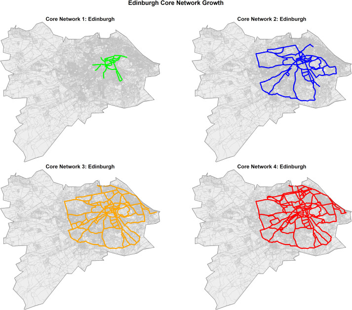

#  {.unlisted background-image="other_template/img/gray.png"}

::::::: {style="text-align: center; margin-top: 1em;"}
<h1 class="title" style="margin-bottom: 0.2em;">

Quantifying the evolution of cycling network performance

</h1>

<h2 class="subtitle" style="margin-top: 0;">

A 50-city panel data analysis using open data

</h2>

::::: {layout-ncol="2" style="margin-top: 3em; align-items: flex-start;"}
::: {#rosa}
**Rosa Félix**

[U-Shift lab, CERIS, Técnico]{style="font-size: 0.75em; color: #666;"}

{width="200"}
:::

::: {#david}
**David Levinson**

[TransportLab]{style="font-size: 0.75em; color: #666;"}

{width="200"}
:::
:::::

::: {style="margin-top: 0.5em; font-size: 0.9em; color: #424141;"}
March 13, 2026
:::
:::::::

# A bit about me {#about .unlisted}

::: {.columns .v-center-container}
::: {.column width="40%"}
{fig-align="center" width="400"}
:::

::: {.column style="padding-left: -15%;"}
**Rosa Félix**

-   🎓 Researcher and Invited Assistant Professor
-   🚴‍♀️ Active mobility, Behaviour change, GIS
-   🏘️🇵🇹 U-Shift Lab, CERIS, Técnico - University of Lisbon 
-   🌏🇦🇺 Visiting researcher for 4-months at the University of Sydney
:::
:::

# Objectives {transition="fade-in slide-out" background-image="other_template/img/gray.png"}

---

## How the cycling network expansion impacts

-   **Trip efficiency**: duration, distance, circuity ⏱️
-   **Safety**: Traffic Stress exposure 🛡️
-   **Accessibility**: 15-min potential to opportunities 🏫
-   **Continuity**: number of interruptions when using cycling infrastructure 🛑

::: fragment
 
**Goals**:

-   Analyze the evolution for the last 10 years (2016-2026) across 50 cities
-   Estimate model elasticities of improvements
:::

# Data {transition="fade-in slide-out" background-image="other_template/img/gray.png"}

## Historical OpenStreetMap (OSM)

-   **Source:** [Geofabrik](https://download.geofabrik.de/) 🗺️
    -   Routing (road network)
    -   Cycling Infrastructure classification

::: {layout-ncol="1"}

:::

## Buildings as origins/destinations

-   Avoiding census or travel survey data to ensure global reproducibility.
-   Used Global Building Atlas - Lod1 [@zhu2025].
-   Buildings were weighted by estimated volume to act as a proxy for trip attraction.

::: {layout-ncol="3"}


:::

## Selected Cities

-   **N = 50 cities** with \> 1 million residents, balanced across continents.
-   Cities with varying degrees of **infrastructure expansion** (2016-2026).


{.nostretch fig-align="center" width="1200" style="margin-top: 0px; margin-left: -75px; max-width: none;"}

::: {.absolute top="600" left="30" style="background-color: rgba(255, 255, 255, 0.9); padding: 12px; border-radius: 8px; width: 150px; font-size: 14px; box-shadow: 2px 2px 5px rgba(0,0,0,0.3); text-align: left; z-index: 100;"}
**Coords sources:** NGIA, USGS, US Census, NASA.
:::


## Excluded Cities

::::: {.columns}
::: {.column width="50%"}
Some cities (8) were removed due to:

-   **Scale**: Not having $\geq$ 100 km of CI by 2026
-   **Quality**: OSM tagging variability
-   **Growth**: No CI expansion ($<$ 10% 2016-2026)

{width="1000"}
:::

::: {.column width="50%"}
::: {layout-nrow="2"}
{width="1000"}
{width="1000"}
:::
:::
:::::


## Cycling Infrastructure Evolution

-   Evolution of Absolute Cycling Infrastructure by year and across the target cities.

{fig-align="center"}

# Data Processing {transition="fade-in slide-out" background-image="other_template/img/gray.png"}

## Methods

A simple flowchart from data sources to the final datasets:

::: {style="text-align: center;"}
{fig-align="center" width="1050"}
:::

Efficient and reproducible pipeline:

  - Each city takes **~20 minutes** to run the full pipeline
  - Generates about 3GB of routing data per city

## Tools

::::::: {layout="[[25,25,25,25]]"}
::: fragment
{width="150" fig-align="center"}</br> **R** (`sf`, `sfnetworks`, etc.)
:::

::: fragment
{width="150" fig-align="center"}</br> **DuckDB** for connections
:::

::: fragment
{width="150" fig-align="center"}</br> **Java R5** (Conveyal)
:::

::: fragment
{width="150" fig-align="center"}</br>**Gemini Pro 3.1** *For scaling the R scripts into an efficient pipeline supporting 50 cities.*
:::
:::::::

## OD Pairs Generation

-   **20,000 OD pairs** generated per city.
-   Origin hex distances follow a Log-normal function calibrated for cycling trips [@schneider2023; @wang2025].

::: {layout-ncol="2"}

:::

## CI Classification in 4 types

We re-categorized OSM tags into 4 simplified types to assess infrastructure quality:

``` sql
-- Example snippet conceptually assigning specific CI types
CASE WHEN highway='cycleway' THEN 'Protected'
     WHEN cycleway='lane' THEN 'Painted'
     WHEN cycleway='shared_lane' THEN 'Sharrows'
     ELSE 'Foot' END
```

## CI Classification

We re-categorized OSM tags into 4 simplified types:

::::: {layout="[[1, 1]]"}
::: {#col1}
### 1. Protected

![\[Image: Protected\]](https://placehold.co/600x400?text=Protected+CI)
:::

::: fragment
### 2. Painted

![\[Image: Painted\]](https://placehold.co/600x400?text=Painted+Lanes)
:::
:::::

------------------------------------------------------------------------

## CI Classification (cont.)

::::: {layout="[[1, 1]]"}
::: {#col3}
### 3. Sharrows

![\[Image: Sharrows\]](https://placehold.co/600x400?text=Sharrows)
:::

::: fragment
### 4. Foot

![\[Image: Foot\]](https://placehold.co/600x400?text=Footpaths)
:::
:::::

## Routing & LTS

### Level of Traffic Stress (LTS)

-   Uses [Mineta Transport Insitute](https://transweb.sjsu.edu/research/Low-Stress-Bicycling-and-Network-Connectivity) classification, adapted from Conveyal algorithms [@conway2015].
-   Uses the specific CI classification of each year to lower the LTS score to 1.
-   *Note:* Protected CI is often drawn as a separated segment in OSM, whereas painted lanes act as tags on the main roadway.

------------------------------------------------------------------------

### R5r package

r5r R package [@pereira2021] for routing in bicycle mode.

```r
library(r5r)
trips <- detailed_itineraries(
    r5r_network = r5_engine, # for each city and year
    origins = origins_hex,
    destinations = dests_hex,
    mode = "BICYCLE",
    shortest_path = TRUE,
    max_lts = lts_level, # 1, 2, 3, or 4
    osm_link_ids = TRUE # to match segments with LTS level
)
```

-   **max_lts** constraint limits route choice.
-   If no connected low-stress route exists, the engine penalizes the route by demoting the travel speed to *walking speed* (3.6 km/h) instead of cycling (12 km/h).
-   The exact same OD pairs over different years.

## Overline Maps (Used Routes)

Highlighting the most preferred routes iteratively for LTS 1 and LTS 2.

::: {layout-ncol="2"}


:::

# Modeling {transition="fade-in slide-out" background-image="other_template/img/gray.png"}

We employed Fixed Effects Panel Regression models across both Macro and Micro levels.

## Macro Level (City Wide)

-   Exploring how massive expansions affect overall city averages using two-way Fixed Effects (City + Year).

$$ \ln(Y_{ct}) = \beta \cdot \ln(\text{Total Infra}_{ct}) + \alpha_c + \gamma_t + \epsilon_{ct} $$

**Key Gemini Highlight:** *We have a massive amount of route-level observations (e.g., millions of routes), but our main independent variable (kilometers of infrastructure) varies only at the **city-year level**. This significantly limits the effective sample size and necessitates interpreting standard errors with care.*

### Macro Results Summary

-   **Accessibility**: A 10% increase in city-wide protected infrastructure correlates to consistent positive gains in the 15-min accessibility volume.
-   **Duration**: Average network duration drops significantly as more trips can utilize 12km/h segments rather than walking detours.

## Micro Level (Route)

-   \~5 million LTS 1 bounded route observations.

$$ \ln(Y_{irt}) = \beta_1 \text{Protected}_{irt} + \beta_2 \text{Painted}_{irt} + \beta_3 \text{Sharrows}_{irt} + \alpha_{ir} + \gamma_t + \epsilon_{irt} $$

We analyzed: - Form factors separating Protected vs. Paint vs. Sharrows. - Log Duration & Log Circuity. - Safety (Weighted LTS and proportion of LTS 1). - Interruptions mapping.

------------------------------------------------------------------------

### Micro Results Highlights

::: {layout-ncol="2"}


:::

-   Validates that **Protected CI** is the ONLY infrastructure type that drastically reduces interruptions.
-   Cyclists will accept a higher physical detour (circuity) to achieve a safer faster trip (duration).

------------------------------------------------------------------------

### The Alternative LTS

Comparing the baseline Original LTS routing schema with the Alternative LTS usage mapping.

::: {layout-ncol="2"}


:::

# Findings {transition="fade-in slide-out" background-image="other_template/img/gray.png"}

-   **1km expansion of CI**: Yields statistically significant improvements in accessibility and decreases in mean route interruptions.
-   **Quality Matters**: Paint and sharrows do not provide the safety "glue" needed to patch fragmented networks. High-quality protected segments are strictly superior for network cohesion.
-   **The Arterial Lure**: Protected infrastructure provides disproportionate benefits on medium distance functional routes.

# Limitations {transition="fade-in slide-out" background-image="other_template/img/gray.png"}

## Routing Engine

-   Calm residential roads are often assigned the same LTS 1 status as dedicated CI, meaning the engine may route through dense neighborhoods rather than designated lanes.
-   Subjective bias associated with custom time-cost schemas in routing penalizations.

## Endogeneity & OSM Data

-   **Endogeneity Issue**: Cities don't place bike lanes randomly. They build them where cycling demand is already high or space is cheap. This biases elasticity estimates unless Instrumental Variables (IV) are applied (e.g., historical railway lines). ⚠️
-   **Tagging evolution**: How OSM segments are tagged constantly changes over the 10 years, introducing noise that misconstrues physical change.

# Further Research {transition="fade-in slide-out" background-image="other_template/img/gray.png"}

-   Pre-process more cities (\~200) 🌍
-   Add more temporal points to smooth tagging fluctuations.
-   Use empirical GPS panel data for identical ODs to validate behavior.
-   Validate OSM tags with random sampling protocols to refine the sample selection.

# Questions

**Questions, comments, and suggestions are welcome!** 💬

# Thank You {.center .unlisted transition="fade-in slide-out" background-image="other_template/img/gray.png"}

::: {align="center"}
**Rosa Félix**

Funded by FCT Mobility:

 

<br><br>

{width="300"} *(Sample Placeholder for Git/UShift QR)*
:::

## References {.small}

::: {#refs}
:::