#  {.unlisted background-image="other_template/img/gray.png"}

::::::: {style="text-align: center; margin-top: 1em;"}
<h1 class="title" style="margin-bottom: 0.2em;">

Quantifying the evolution of cycling network performance

</h1>

<h2 class="subtitle" style="margin-top: 0;">

A 50-city panel data analysis using open data

</h2>

::::: {layout-ncol="2" style="margin-top: 3em; align-items: flex-start;"}
::: {#rosa}
**Rosa Félix**

[U-Shift lab, CERIS, Técnico]{style="font-size: 0.75em; color: #666;"}

{width="200"}
:::

::: {#david}
**David Levinson**

[TransportLab]{style="font-size: 0.75em; color: #666;"}

{width="200"}
:::
:::::

::: {style="margin-top: 1em; font-size: 0.85em; color: #424141;"}
March 13, 2026 — TransportLab Seminar, University of Sydney

::: {style="font-size: 0.75em; margin-top: 0.5em; color: #888;"}
Funded by FCT Mobility (Portuguese Science Foundation)
:::
:::
:::::::

# A bit about me {#about .unlisted}

::: {.columns .v-center-container}
::: {.column width="40%"}
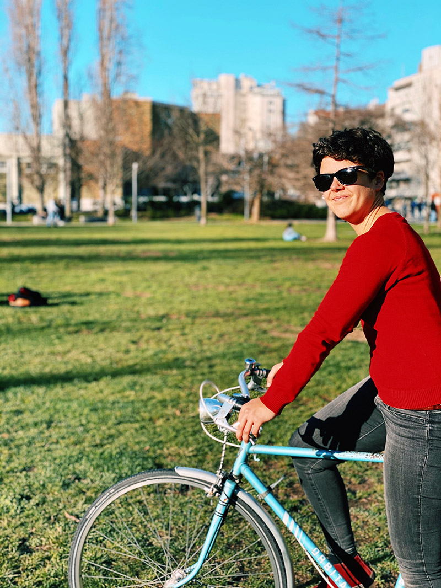{fig-align="center" width="380"}
:::

::: {.column style="padding-left: 1em;"}
**Rosa Félix** 🧑‍🔬

-   🎓 Researcher & Invited Assistant Professor
-   🚴‍♀️ Active mobility, Behaviour change, GIS
-   🏘️🇵🇹 U-Shift Lab, CERIS, Técnico – University of Lisbon
-   🌏🇦🇺 4-month visiting researcher at the University of Sydney
:::
:::

# Objectives {transition="fade-in slide-out" background-image="other_template/img/gray.png"}

---

## How does cycling network expansion impact…

-   **Trip efficiency**: duration, distance, circuity ⏱️
-   **Safety**: Level of Traffic Stress exposure 🛡️
-   **Accessibility**: 15-min potential to reach opportunities 🏫
-   **Continuity**: number of interruptions when using CI 🛑

::: fragment
 

**Goals**:

-   Analyze 10 years of evolution (2016–2026) across **50 cities**
-   Estimate **model elasticities** of infrastructure improvements
-   Distinguish effects by infrastructure **type** (protected, painted, sharrows, shared foot)
:::

# Data {transition="fade-in slide-out" background-image="other_template/img/gray.png"}

## Historical OpenStreetMap (OSM)

-   **Source:** [Geofabrik](https://download.geofabrik.de/) 🗺️
    -   Full road network for routing
    -   Cycling infrastructure classification

::: {layout-ncol="1"}
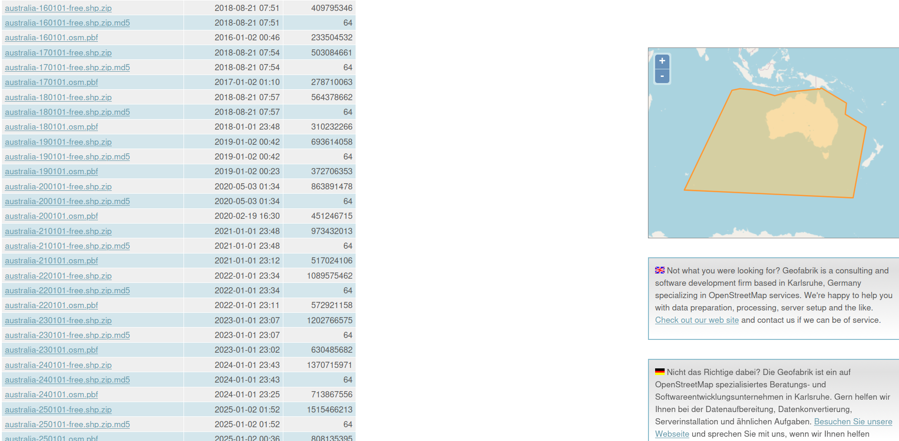
:::

## Buildings as origins/destinations

-   Avoiding census or travel survey data → global reproducibility.
-   Used Global Building Atlas – LoD1 [@zhu2025].
-   Buildings weighted by estimated **volume** as a proxy for trip attraction.

::: {layout-ncol="3"}


:::

## Selected Cities

-   **N = 50 cities** with > 1 million residents, balanced across continents.
-   Cities with **cycling infrastructure expansion** (2016–2026).

{.nostretch fig-align="center" width="1200" style="margin-top: 0px; margin-left: -75px; max-width: none;"}

::: {.absolute top="550" left="20" style="background-color: rgba(255, 255, 255, 0.9); padding: 12px; border-radius: 8px; width: 150px; font-size: 14px; box-shadow: 2px 2px 5px rgba(0,0,0,0.3); text-align: left; z-index: 100;"}
**Coords sources:** National Geospatial Intelligence Agency, USGS, US Census, NASA ([simplemaps.com/data/world-cities](https://simplemaps.com/data/world-cities)).
:::

## Excluded Cities

::::: {.columns}
::: {.column width="55%"}
**8 cities excluded** due to:

-   **Scale**: < 100 km of CI by 2026
-   **Growth**: < 10% CI expansion in 2016–2026
-   **Quality**: OSM tagging variability
<br><br>

{width="1000"}
:::

::: {.column width="45%"}
::: {layout-nrow="2"}
{width="1000"}

{width="1000"}
:::
:::
:::::

## Cycling Infrastructure Evolution

Evolution of absolute cycling infrastructure across the **50 cities** (2016–2026)

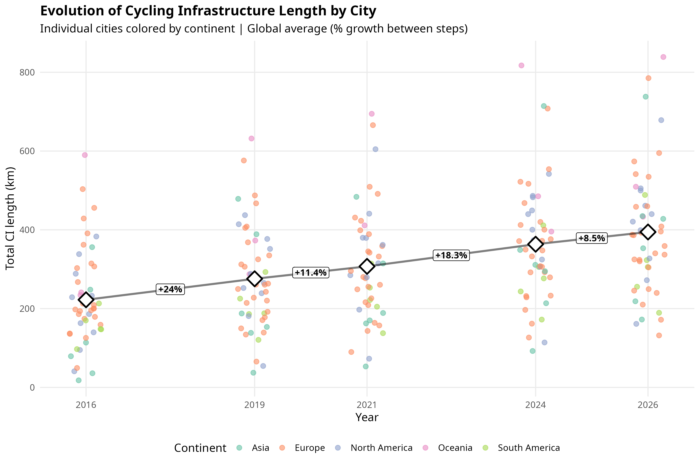{fig-align="center"}

::: {style="font-size: 0.7em; color: #555; text-align: center;"}
<!-- Each point = one city × one year. Line = continental average. Strong growth especially in Europe and Americas. -->
:::

# Data Processing {transition="fade-in slide-out" background-image="other_template/img/gray.png"}

## Methods Overview 

::: {style="text-align: center;"}
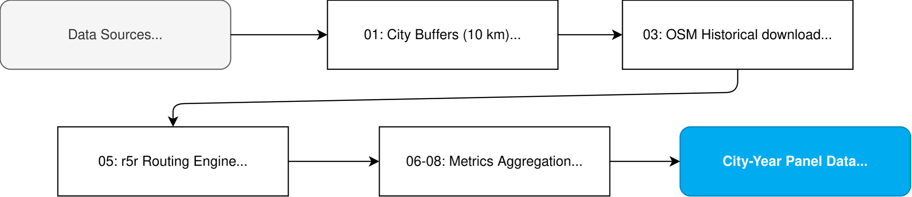{fig-align="center" width="1050"}
:::
::: fragment
Efficient and reproducible pipeline:

-   Each city takes **~20 minutes** to run the full pipeline
-   Generates **~3 GB of data** per city
:::

## Tools

::::::: {layout="[[25,25,25,25]]"}

{width="150" fig-align="center"}</br> **R** </br> `sf`, `h3jsr`, `osmactive`, `r5r`, `stplanr`, `fixest`

{width="150" fig-align="center"}</br> **DuckDB** </br> Global Building Atlas data connection

{width="150" fig-align="center"}</br> **Java / R5** </br>Conveyal routing engine

{width="150" fig-align="center"}</br>**Gemini 3.1 Pro** Scaling R scripts into an efficient 50-city pipeline

:::::::

## OD Pairs Sampling

::::: {.columns}
::: {.column width="60%"}

-   **10km** buffer from city center coordinates
-   **20,000 OD pairs** generated per city

-   Destinations randomly sampled, weighted by **building volume** (proxy for trip attraction)
-   Distance follows a **log-normal function** calibrated for cycling trips [@kou2019]
-   Origin hexagons (with buildings) sampled using **[H3](https://h3geo.org/) resolution 9** [(~200m edge length, ~400m "diameter", ~0.105 km²)]{style="font-size: 0.8em"}
:::

::: {.column width="40%"}

{fig-align="center"}

:::
:::::

---

{.nostretch fig-align="center" width="1250" style="max-width: none; margin-left: -100px;"}

---

{.nostretch fig-align="center" width="1250" style="max-width: none; margin-left: -100px;"}

---

{.nostretch fig-align="center" width="1250" style="max-width: none; margin-left: -100px;"}

---

{.nostretch fig-align="center" width="1250" style="max-width: none; margin-left: -100px;"}

---

{.nostretch fig-align="center" width="1250" style="max-width: none; margin-left: -100px;"}

---

{.nostretch fig-align="center" width="1250" style="max-width: none; margin-left: -100px;"}

---

### Trip distance distribution

-   Log-normal calibration ensures routes resemble **realistic urban cycling** trips.

::: {layout-ncol="2"}
{width="700" fig-align="center"}

{width="700" fig-align="center"}
:::

<!-- Arrow overlay -->
::: {.absolute top="65%" left="45%" style="transform: translate(-50%, -50%); font-size: 160px; color: rgba(219, 58, 58, 0.86); z-index: 100;"}
→
:::

::: {style="font-size: 0.7em; color: #555; text-align: right;"}
<!-- With calibration, the distribution matches urban cycling patterns. -->
About 75% of trips are below 5 km. This already accounts for ~40% circuity.
:::

## CI Classification in 4 types

With `osmactive` custom classification of CI, we classified OSM segments into **4 simplified types** to assess infrastructure quality, based on OSM tags:

::: {style="font-size: 0.8em;"}
| Type | OSM examples |
|----|--------|
| **Protected** (separated) | `highway:cycleway` → separated tracks |
| **Painted** (medium) | `cycleway:lane` → bike lanes on road |
| **Sharrows** (weak/mixed) | `cycleway:shared_lane` → advisory |
| **Foot** (shared w/pedestrian) | `highway:pedestrian` & `bicycle:yes` → shared paths |
:::

<br>

```sql
-- Conceptual query (based on osmactive logic)
CASE WHEN highway = 'cycleway' OR cycleway IN ('track', 'opposite_track') THEN 'Protected'
     WHEN cycleway IN ('lane', 'opposite_lane') THEN 'Painted'
     WHEN cycleway IN ('share_busway', 'shared_lane') OR bicycle_road = 'yes' THEN 'Sharrows'
     WHEN highway IN ('path', 'footway', 'pedestrian') AND bicycle IN ('yes', 'designated')
          THEN 'Foot'
END AS ci_type
```

---

### CI Type examples

1. Protected CI

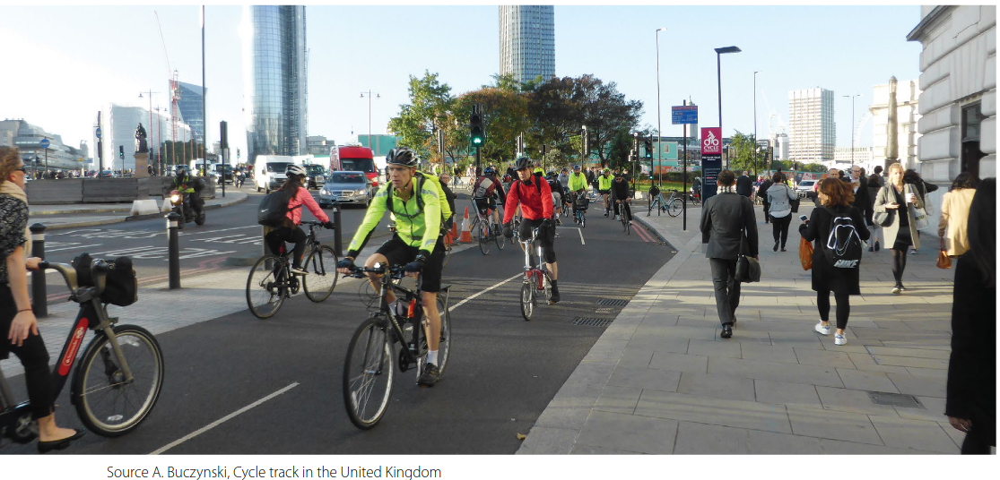{fig-align="center"}

[Source: *Definitions for cycling infrastructure* [@unece26]]{style="font-size: 0.7em"}

---

### CI Type examples

2. Painted CI

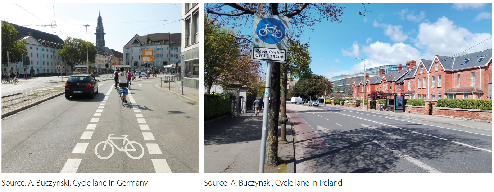{fig-align="center"}

[Source: *Definitions for cycling infrastructure* [@unece26]]{style="font-size: 0.7em"}

---

### CI Type examples

3. Mixed / Shared with motor traffic CI

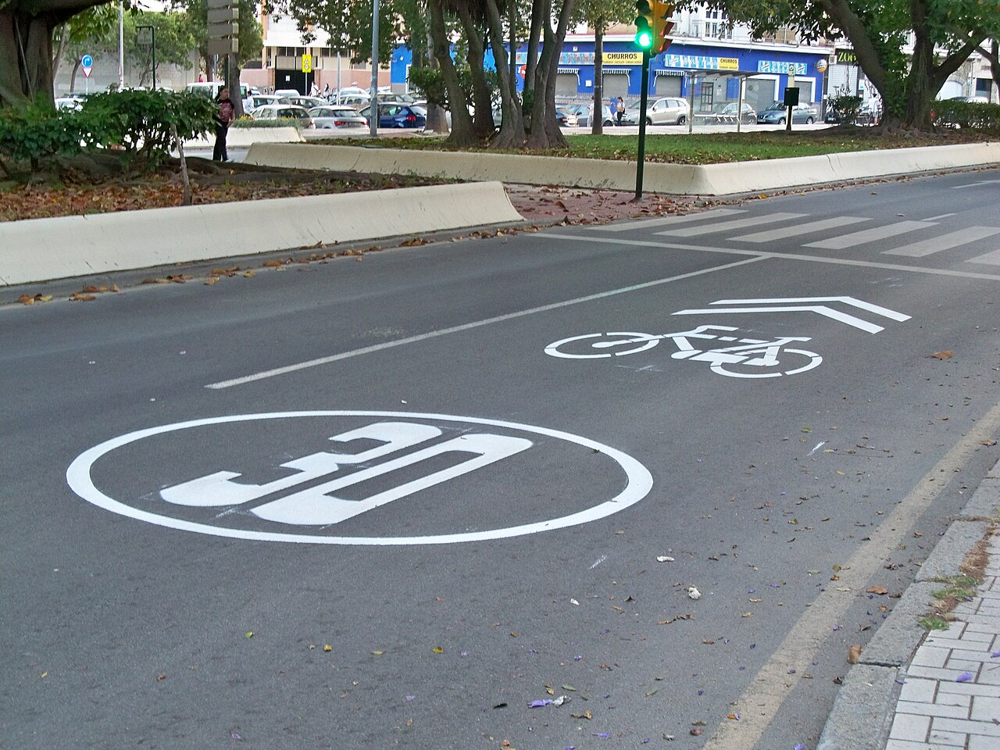{fig-align="center"}

[Source: *Daniel Capilla, [Wikimedia](https://commons.wikimedia.org/wiki/File:Sharrow_in_M%C3%A1laga.jpg)*]{style="font-size: 0.7em"}

---

### CI Type examples

4. Shared with pedestrians CI

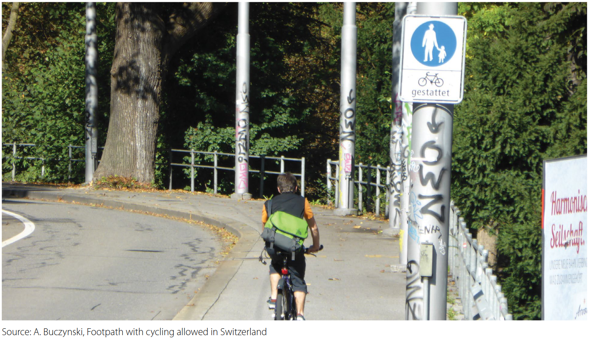{fig-align="center"}

[Source: *Definitions for cycling infrastructure* [@unece26]]{style="font-size: 0.7em"}

---

### CI evolution by type

::: {layout-ncol="2"}


:::

---

### CI evolution – Santiago

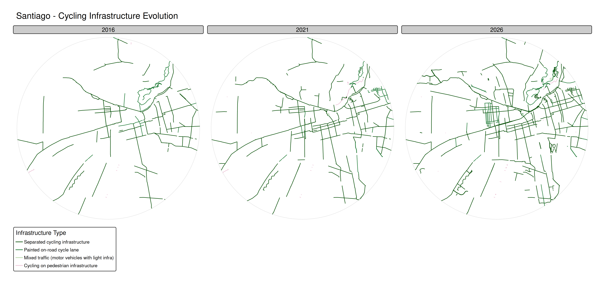

::: {.absolute bottom="-25%" right="0%" style="width: 500px;"}

:::

---

### CI evolution – London

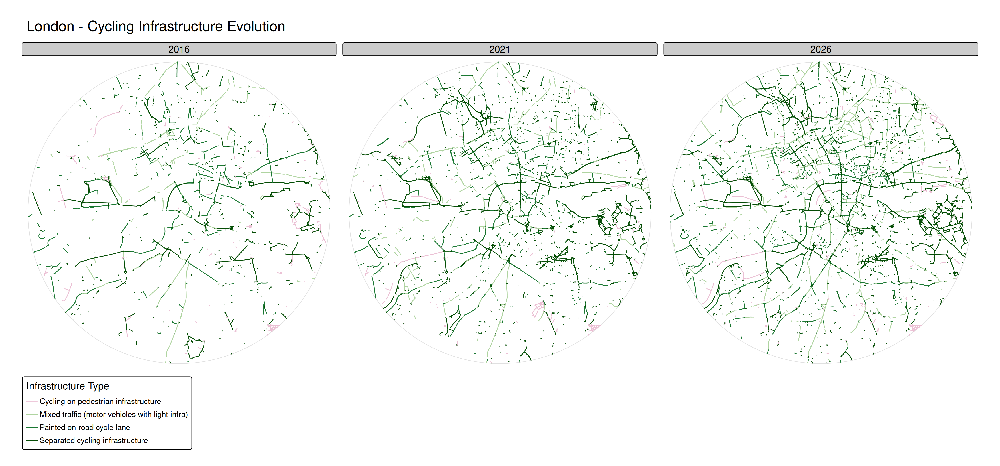

::: {.absolute bottom="-25%" right="0%" style="width: 500px;"}

:::

---

### CI evolution – Brussels


::: {.absolute bottom="-25%" right="0%" style="width: 500px;"}

:::

---

### CI evolution – Christchurch


::: {.absolute bottom="-25%" right="0%" style="width: 500px;"}

:::

---

### CI evolution – Montréal


::: {.absolute bottom="-25%" right="0%" style="width: 500px;"}

:::

---

### CI evolution – São Paulo


::: {.absolute bottom="-25%" right="0%" style="width: 500px;"}

:::


## Level of Traffic Stress (LTS)

-   Classification from [Mineta Transport Institute](https://transweb.sjsu.edu/research/Low-Stress-Bicycling-and-Network-Connectivity) (2012)

](https://miro.medium.com/v2/resize:fit:2000/format:webp/1*0ijfn6V7MYZuuA5wM0zeIw.jpeg)

::: fragment
-   Adapted by Conveyal [@conway2015] to applied to every OSM **edge** as:

```{.javascript code-line-numbers="1-2|3-4|5|6"}
If way does not allow cars → LTS 1
If highway:residential / living_street → LTS 1
If maxspeed < 40 km/h AND lanes < 4 → LTS 2
If highway:tertiary/unclassified + cycleway tag → LTS 2
If cycleway tag on busier road → LTS 3
Otherwise → LTS 4
```

:::

---

### LTS classification - examples

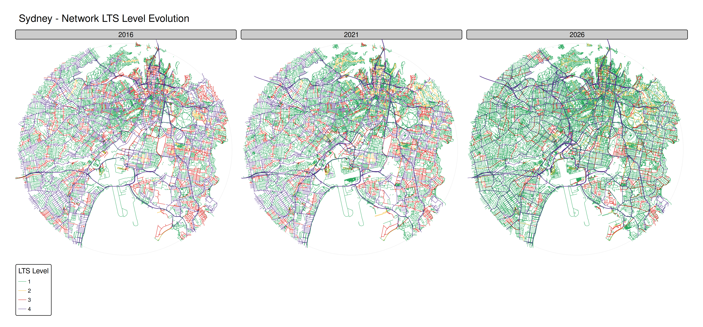{.nostretch fig-align="center" width="1250" style="max-width: none; margin-left: -100px;"}

---

### LTS classification - examples

{.nostretch fig-align="center" width="1250" style="max-width: none; margin-left: -100px;"}

---

### LTS classification - examples

{.nostretch fig-align="center" width="1250" style="max-width: none; margin-left: -100px;"}

---

### LTS classification - examples

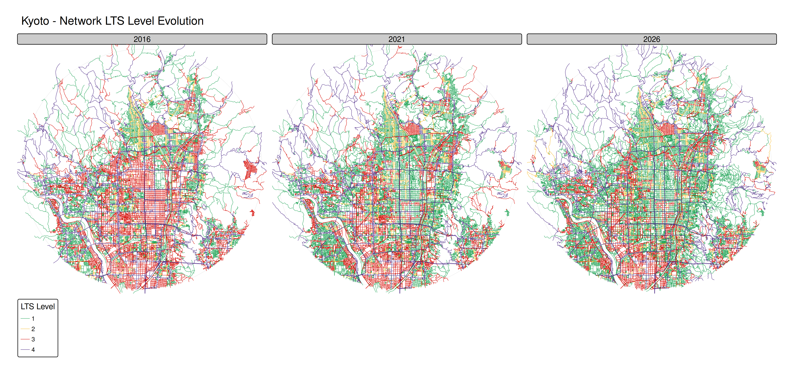{.nostretch fig-align="center" width="1250" style="max-width: none; margin-left: -100px;"}

---

### LTS classification - examples

{.nostretch fig-align="center" width="1250" style="max-width: none; margin-left: -100px;"}

---

### LTS classification - examples

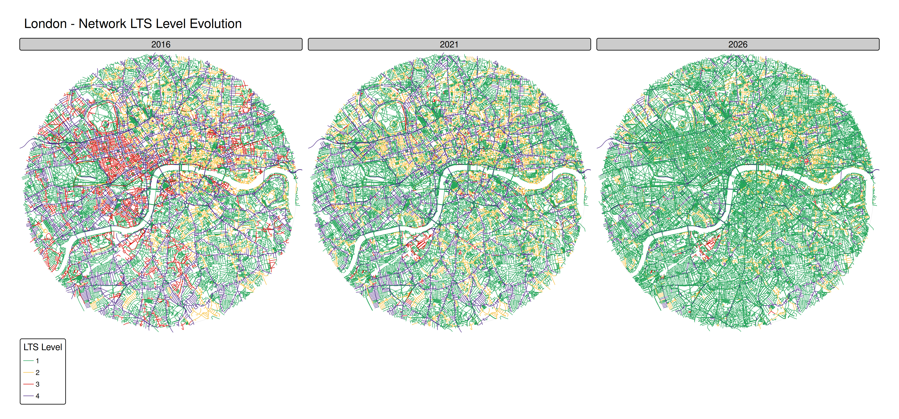{.nostretch fig-align="center" width="1250" style="max-width: none; margin-left: -100px;"}

---

### LTS problem for bicycle routing

But... 

::: {layout-ncol=2}
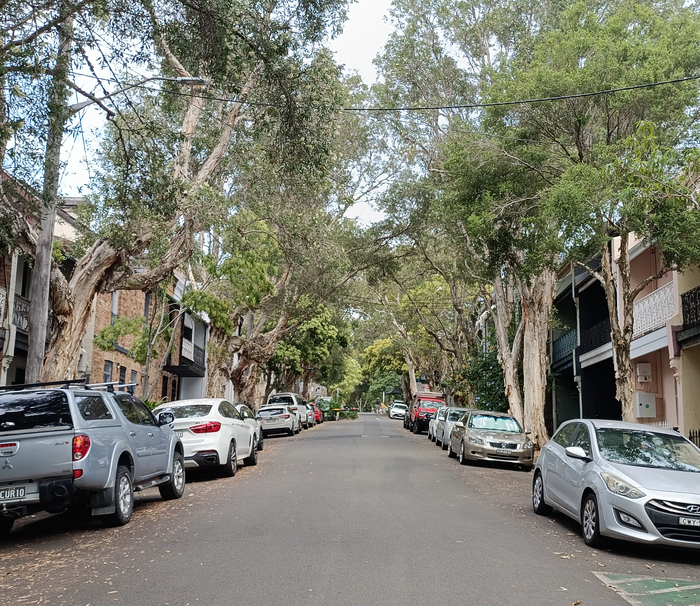{width="90%"}

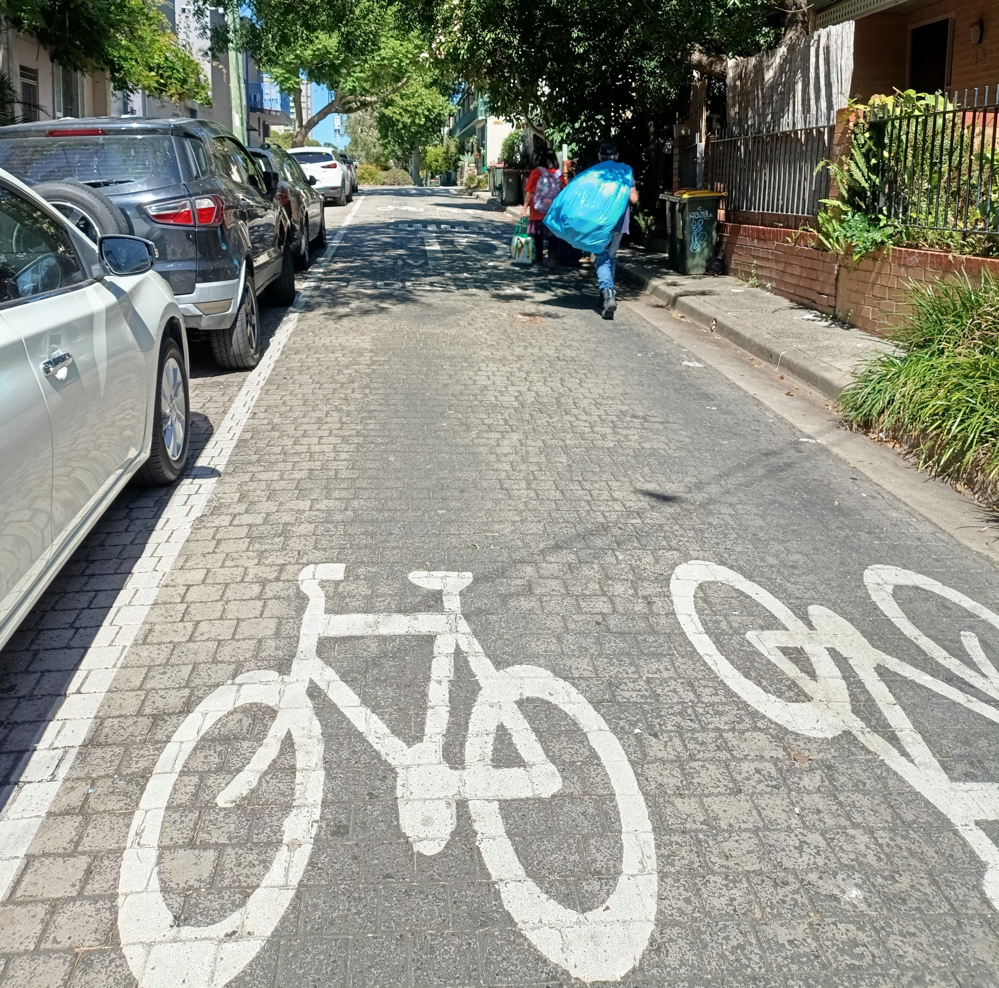{width="80%"}

:::

[Source: *Author*]{style="font-size: 0.7em"}

### LTS problem for bicycle routing

Or... 

::: {layout-ncol=2}


:::

[Source: [A Mensagem](https://amensagem.pt/2025/06/25/estacionamento-lisboa-habitacao-transporte-mobilidade/) / [EMEL](https://www.emel.pt/pt/noticias/rumo-a-uma-lisboa-mais-ciclavel/)]{style="font-size: 0.7em"}


### LTS problem for bicycle routing

Or even... 

::: {layout-ncol=2}
{width="90%"}

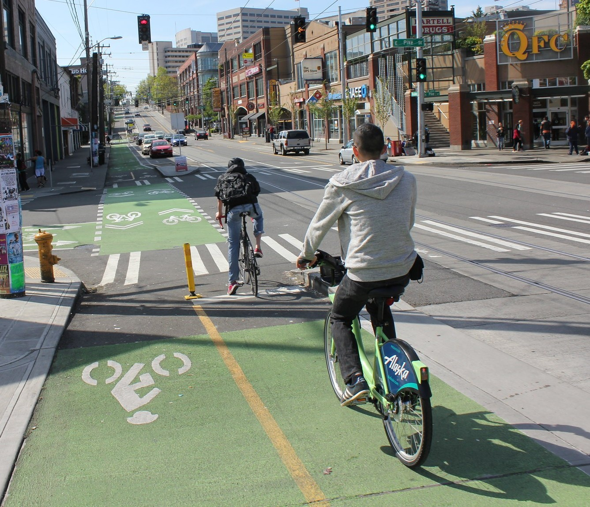

:::

[Source: *Author* / [nickfalbo/flickr](https://www.flickr.com/photos/83492056@N00/17434162236/in/photolist-syAD35-sATUsr-sjjvsW-8KbN4C-rE5rEz-qYkFe4-X4a7xW-ABhUWE-eEGZNh-gZJTRx-gZJeJv-X4aFoq-g7hEp-fzRmFb-ei9HWA-oPUx6e-sLZnd7-6vr9he-bpJMJw-ADu1wH-fzBbzn-XE8Fix-X78CBD-oPULtV-oR36tQ-qYiTBD-WJ3ajU-co6Vzs-78xMQG-6vvkB7-W5DDVT-XiU8pD-W5DUkp-7TH39Z-XiVmoH-huv7eA-niLc5d-rfDKC4-Sd66ti-W5Emmn-6vD8w1-co5vc9-ey66XR-PURan-ocZz9c-eEHM7A-eECESz-6vyWor-dZN813-6BxbCm)]{style="font-size: 0.7em"}

---

### LTS problem for bicycle routing

::: {layout-ncol=2}
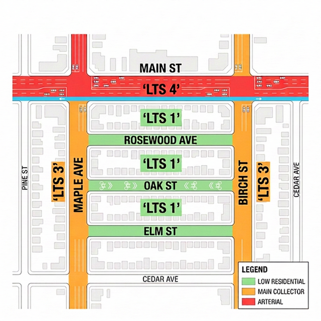


:::

---

### LTS problem for bicycle routing

::: {layout-ncol=2}
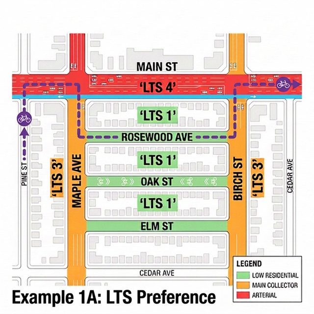

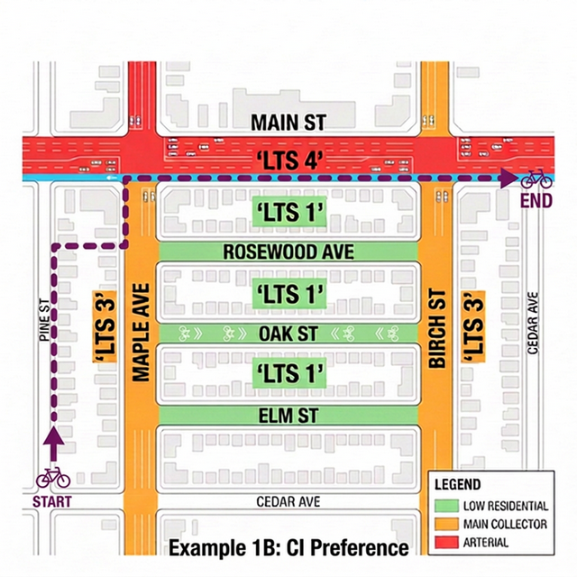

:::

---

### LTS problem for bicycle routing

::: {layout-ncol=2}
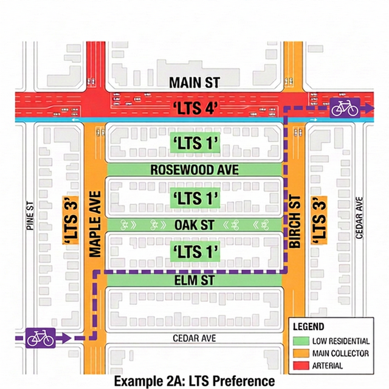

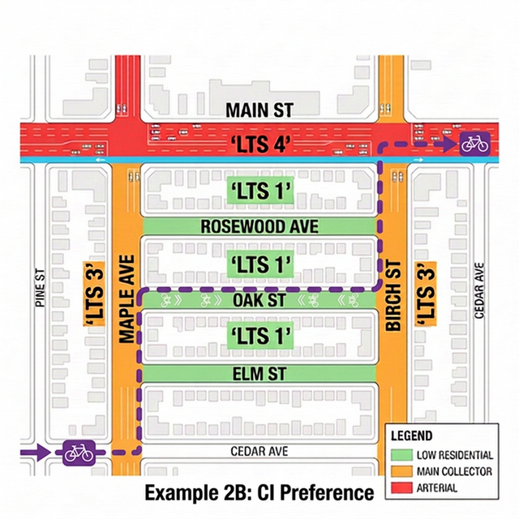

:::

---

### LTS alternative

-   Each year's CI classification is used to **override LTS to 1** on newly classified CI segments (tryed with [LTS = 0](https://github.com/ipeaGIT/r5r/issues/553)...).

::: {style="font-size: 0.75em; color: #555; margin-top:0.5em;"}
**Note:** Protected CI is drawn as a *separate segment* in OSM; painted lanes are *tags* on the road. Both approaches are modelled correctly here.
:::

---

### r5r routing package

`r5r` R package [@pereira2021] for bicycle routing:

```r
library(r5r)
trips <- detailed_itineraries(
    r5r_network = r5_engine,   # city × year street network
    origins = origins_hex,
    destinations = dests_hex,
    mode = "BICYCLE",
    shortest_path = TRUE,
    max_lts = lts_level,       # 1, 2, 3, or 4
    osm_link_ids = TRUE        # match segments with LTS
)
```

-   **`max_lts`** limits route choice to low-stress paths.
-   If no connected low-stress route exists: R5 penalises the segment by setting speed to **walking pace (3.6 km/h)** instead of cycling (12 km/h) → 3× time penalty.
-   **Same 20,000 OD pairs used across all years** → clean panel comparisons.

## Overline Maps (Used Routes)

stplanr overline


Highlighting the most frequently used network segments for LTS 1 routing.

::: {layout-ncol="2"}


:::

## Accessibility – 15-min potential

-   For each origin (H3 hex), we compute the **sum of building volumes** reachable within a 15-minute cycling trip.
-   Increases when more destinations become reachable, or existing destinations become fast enough to reach with low stress.

::: {layout-ncol="2"}


:::

# Modelling {transition="fade-in slide-out" background-image="other_template/img/gray.png"}

Fixed Effects Panel Regression across **Macro (city-wide)** and **Micro (route-level)** scales.

## Macro Level (City-Wide)

-   How do **massive, city-scale expansions** affect overall averages?
-   **Two-way Fixed Effects** (city + year), LTS 1 and LTS 2 subsets.

$$\ln(Y_{ct}) = \beta \cdot \ln(\text{Total CI}_{ct}) + \gamma \cdot \ln(\text{Road km}_{ct}) + \alpha_c + \tau_t + \epsilon_{ct}$$

::: {style="font-size: 0.75em; color: #555; margin-top: 0.5em;"}
**Effective sample:** 51 cities × 5 years = **255 observations** per LTS level. Standard errors clustered by city.
:::

::: {.callout-note style="font-size: 0.8em;"}
**Key statistical note:** The main independent variable (km of CI) varies only at the city-year level, even though routing outcomes are averaged over 20,000 routes. The effective degrees of freedom are lower than the observation count suggests.
:::

---

### Macro Results – Duration & Accessibility

| Model | Dep. variable | Coef. Total CI | Signif. |
|---|---|---|---|
| LTS 1 | log(avg_duration) | **−0.066** | *** |
| LTS 2 | log(avg_duration) | **−0.089** | *** |
| LTS 1 | log(access_15min) | **+0.175** | * |
| LTS 2 | log(access_15min) | **+0.197** | ** |

Within R² ≈ 0.10–0.24 (two-way FE absorb most city/year variation)

::: {.callout-tip style="font-size: 0.8em;"}
**Interpretation (log-log):** A **10% expansion** of total CI reduces average LTS 1 trip duration by **0.66%**, and increases 15-min accessible destinations by **1.75%**.
:::

---

### The Accessibility Story

> *"Building bike lanes doesn't necessarily make trips faster; it makes them **possible**, and it makes them **safe**."*

-   **Duration effect:** small but real – network growth saves time
-   **Accessibility effect:** larger – new CI bridges previously uncrossable barriers (arterials, rivers, highways), unlocking thousands of new destinations within a safe 15-min ride

::: {style="font-size: 0.8em; color: #446;"}
If a city expands its network by **50%**, accessibility for cautious riders jumps by ~**9%** — thousands of new jobs and services within a safe 15-minute ride.
:::

## Micro Level (Route)

-   ~**9.9 million** LTS 1 route observations (50 cities × 5 years × 20k ODs).
-   Fixed effects at **route × year** level — each OD pair controls for itself.

$$ \ln(Y_{irt}) = \beta_1 \text{Protected}_{rt} + \beta_2 \text{Painted}_{rt} + \beta_3 \text{Sharrows}_{rt} + \beta_4 \text{Foot}_{rt} + \alpha_{ir} + \tau_t + \epsilon_{irt} $$

Where $\text{Protected}_{rt}$ = km of protected CI along route $r$ in year $t$.

**Outcomes modelled:**

-   Log duration, log circuity
-   % of route at LTS 1 (safety)
-   Weighted average LTS score
-   Number of CI interruptions (gaps > 100m)

---

### Micro Results – Model Summary

| Outcome | Protected (β) | Painted (β) | Sharrows (β) |
|---|---|---|---|
| Log duration | −0.013 ** | −0.003 | +0.002 |
| Log circuity | +0.013 ** | +0.003 | +0.002 |
| % LTS 1 safe | +0.17 *** | +0.77 *** | +0.77 *** |
| Avg. LTS score | −0.084 ** | −0.055 * | +0.055 |
| Interruptions | −0.084 ** | −0.055 | +0.055 |

::: {style="font-size: 0.65em; color: #555; margin-top: 0.5em;"}
Route + year fixed effects; standard errors clustered by city. Significance: * p<0.1, ** p<0.05, *** p<0.01
:::

---

### The Commuter Trade-off 🔄

::: {layout-ncol="2"}
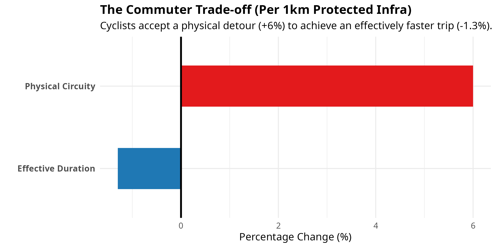

::: {style="font-size: 0.9em; padding-top: 1em;"}
**Per 1 km of protected CI built:**

- Physical circuity **increases by ~6%**  
  *(rider detours to use the safe path)*

- Effective trip duration **decreases by ~1.3%**  
  *(safer route avoids slow mixed-traffic friction)*

> **Cyclists willingly accept a longer detour to achieve a faster, safer trip.**

This is a strong behavioural signal: cyclists value *perceived safety* over raw distance.
:::
:::

---

### The Network Glue 🔗

::: {layout-ncol="2"}
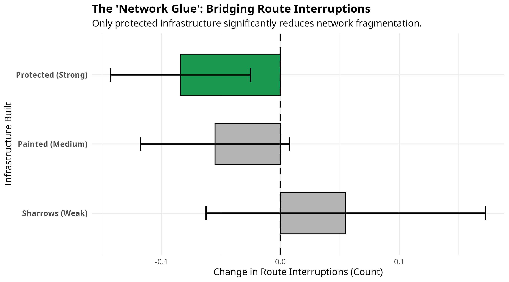

::: {style="font-size: 0.9em; padding-top: 1em;"}
**Impact on route interruptions (gaps > 100m without CI):**

- Protected CI: **−0.084** per km *(significant)* ✅  
  → Closes real gaps in the network
- Painted lanes: **−0.055** per km *(border signif.)* ⚠️
- Sharrows: **+0.055** per km *(not signific., may increase gaps)*

> **Protected infrastructure is the ONLY type that significantly reduces network fragmentation.**

Paint and sharrows do not provide the connectivity "glue" needed to stitch together a continuous, low-stress network.
:::
:::

---

### The Arterial Lure 🛣️

Stress penalty (Avg. LTS increase) by **trip distance** and infrastructure type:

::: {layout-ncol="1"}
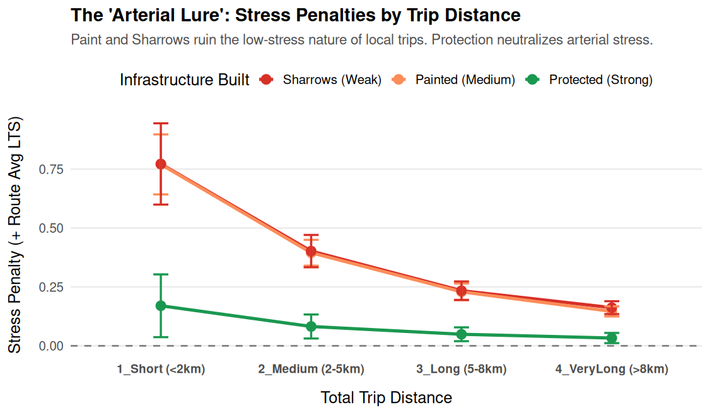{fig-align="center" width="900"}
:::

::: {style="font-size: 0.8em; color: #555;"}
**Key insight:** Paint and sharrows on arterial roads dramatically increase stress penalties for short/medium trips. Protected infrastructure neutralises the stress from arterial crossings across all trip lengths.
:::

## The Alternative LTS

Comparing the **baseline** LTS routing versus an **alternative LTS** assignment that more aggressively recognises CI:

::: {layout-ncol="2"}


:::

::: {style="font-size: 0.8em; color: #555; margin-top: 0.5em;"}
The alternative LTS shows that, when CI is credited more generously, a higher proportion of trips spend time on LTS 1 segments — validating the robustness of the methodology.
:::

---

### The "Fragmentation Phase" Paradox ⚠️

::: {style="font-size: 0.9em;"}
At the macro level, **total CI positively predicts interruptions** (β ≈ +0.26, ***):

> *Each 10% expansion of total CI increases average interruptions per route by ~2.6%*

**Why?** Cities in 2016–2026 were in the **"Fragmented Network Phase"**:

1.  **No CI (Stage 1):** Rider goes fully in mixed traffic → 0 interruptions.
2.  **Fragmented CI (Stage 2):** Isolated "islands" of safe lanes; each new isolated segment creates **2 new gap edges** where the cyclist must enter/exit mixed traffic.
3.  **Mature network (Stage 3):** Connected corridors → interruptions drop.

This is a **data-confirmed policy finding** — not a modelling flaw:

> *"Just building raw kilometres doesn't create a cohesive network. It creates a fragmented, stressful riding experience."*  
> The policy recommendation: shift success metrics from **"km built"** → **"gaps closed"**.
:::

# Findings {transition="fade-in slide-out" background-image="other_template/img/gray.png"}

---

## Key Takeaways

::: {layout-ncol="1"}
| Finding | Metric | Effect |
|---|---|---|
| Network growth saves time | Avg. duration (macro) | −0.66% per 10% CI growth |
| Network unlocks destinations | 15-min accessibility | +1.75–1.97% per 10% CI |
| Detour accepted for safety | Circuity (micro) | +6% per 1km protected CI |
| But trip is effectively shorter | Duration (micro) | −1.3% per 1km protected CI |
| Only protected CI closes gaps | Interruptions | −0.084 per km (signif.) |
| More CI → more gaps (fragmented era) | Interruptions (macro) | +2.6% per 10% CI ⚠️ |
:::

::: {style="margin-top: 0.5em; font-size: 0.85em; color: #554;"}
**The central policy message:**  
Infrastructure works. But **isolated corridors without gap-closing** create a fragmented, stressful network. The win lies in **continuity**, not just quantity.
:::

# Limitations {transition="fade-in slide-out" background-image="other_template/img/gray.png"}

## Routing Engine

-   Calm residential roads (LTS 1 by default) are treated the same as dedicated CI → engine may route through dense neighbourhoods rather than lanes.
-   Custom cost schemes in R5 are subjective; standard LTS was used to maintain reproducibility and comparability.

## OSM Data Quality

-   **Tagging evolution:** OSM segments are tagged differently across years — our algorithm captures some of this, but tagging changes ≠ physical infrastructure changes (e.g., Munich 2021→2026).
-   **Contributions growth:** OSM data density in all cities increased 2016→2026 — some "new CI" may just be newly mapped old CI.
-   **Segment fragmentation:** Protected CI drawn as separate segments is realistic, but increases with tagging evolution.

## Endogeneity ⚠️

-   Cities don't build bike lanes randomly — they build where **demand is highest or space is cheapest**.
-   This biases elasticity estimates upward unless Instrumental Variables (IV) are applied (e.g., historical railway lines, planned-but-unfunded corridors).
-   Current results should be interpreted as **associations**, not causal effects.

::: {style="font-size: 0.8em; color: #655; margin-top: 0.5em;"}
These routing-engine and OSM limitations would affect any study using these data sources — they are inherent to using open, longitudinal data globally.
:::

# Further Research {transition="fade-in slide-out" background-image="other_template/img/gray.png"}

## Further Research

-   **Scale up:** Pre-process ~200 cities 🌍
-   **More time points:** Add 2018, 2019, 2024 to smooth OSM tagging fluctuations and better capture the COVID-19 infrastructure boom

## Further Research (cont.)

-   **Validate OSM tags:** Random sampling to quantify tagging inconsistencies per city
-   **Gap-closing metric:** Develop a specific "network continuity" score and model its elasticities

# Questions? {background-image="other_template/img/gray.png"}

::: {style="text-align: center; margin-top: 1em;"}
Questions, comments, and suggestions are very welcome! 💬

:::

# Thank You {.center .unlisted transition="fade-in slide-out" background-image="other_template/img/gray.png"}

::: {align="center"}
:::: {.columns}
::: {.column width="70%"}
<br><br>
**Rosa Félix**
<br>

[rosamfelix\@tecnico.ulisboa.pt](mailto:rosamfelix@tecnico.ulisboa.pt)<br>
[github.com/temospena/Sydney](https://github.com/temospena/Sydney)
<br><br>

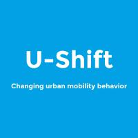


:::

::: {.column width="30%"}
<br><br>
{width="280"}
:::
::::

[Funded by FCT - Fundação para a Ciência e Tecnologia under the **FCT-Mobility** program]{style="font-size: 0.8em"} <br> [(FCT/Mobility/1302410540/2024-25)]{style="font-size: 0.6em; color: #666;"}

    

:::

## References {.small}

::: {#refs}
:::

---

## Bonus: Fixed Effects of Year {visibility="hidden"}

The year fixed effects absorb global macro-trends (e.g., COVID pop-up lanes, e-bike boom) that affect all cities simultaneously.

This means the model is identifying **within-city** changes, holding constant everything that happened globally in any given year — a key strength of the two-way FE approach, but also a limitation: if the global evolution of OSM tagging increased across all cities simultaneously, the year FE would absorb that noise too.
